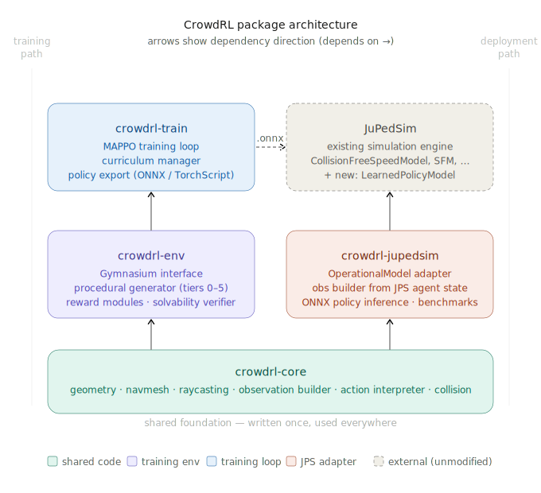
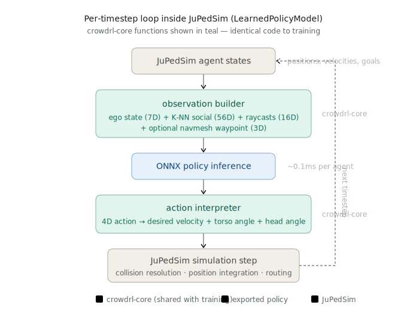

# CrowdRL

[](https://github.com/FabianPlum/CrowdRL/actions/workflows/ci.yml)
[](https://www.python.org/downloads/)
[](https://github.com/astral-sh/ruff)
[](LICENSE)

MARL-learned pedestrian navigation policies trained in procedural 2D environments,
validated against [IAS-7](https://www.fz-juelich.de/en/ias/ias-7) (Forschungszentrum Juelich)
controlled experiment data. Designed to replace or augment hand-crafted locomotion models
in [JuPedSim](https://www.jupedsim.org/).

## Architecture

The project is organised as a uv workspace with five packages that build in strict dependency order:

```
crowdrl-core  ->  crowdrl-env  ->  crowdrl-train  -.onnx->  crowdrl-jupedsim
                                \-> crowdrl-torch
```

<p align="center">
  
</p>

| Package | Purpose | Key dependencies |
|---------|---------|-----------------|
| **crowdrl-core** | Shared geometry, perception, and action library. No RL or JuPedSim dependencies. | NumPy, Shapely, SciPy |
| **crowdrl-env** | Gymnasium training environment with procedural geometry generation (Tiers 0-5) and multi-tier reward. | core + Gymnasium, Matplotlib |
| **crowdrl-train** | MAPPO training loop, curriculum manager, ONNX policy export. | env + PyTorch |
| **crowdrl-torch** | GPU-vectorised environments: batched PyTorch re-implementation of the env step for high-throughput training. | core + env + PyTorch |
| **crowdrl-jupedsim** | `LearnedPolicyModel` adapter that plugs trained policies into JuPedSim's simulation loop. | core + JuPedSim, ONNX Runtime |

The only artefact crossing from training to deployment is an `.onnx` policy file.

### crowdrl-core

Pure geometry/perception/action library with no RL framework dependencies. Submodules:

- **geometry** -- Shapely polygon handling, constrained Delaunay triangulation, navmesh construction, wall-segment extraction
- **navmesh** -- A\* on triangle adjacency graph + funnel algorithm (Simple Stupid Funnel) for shortest-path computation through portal edges
- **sensing** -- Raycast engine (N rays, configurable FOV, head-anchored) + K-nearest-neighbour social query
- **observation** -- Assembles the full observation vector from `WorldState`, identical in training and deployment
- **action** -- Maps 4D policy output to desired velocity + torso angle + head angle
- **collision** -- Elliptical agent collision detection + contact forces

**`WorldState`** is the critical interface: a flat dataclass consumed by all perception code.
Both `crowdrl-env` and `crowdrl-jupedsim` populate it. If population is correct, observations
are numerically identical between training and deployment -- this is the transfer guarantee.

### JuPedSim integration loop

At deployment time, the `LearnedPolicyModel` adapter runs each timestep:

<p align="center">
  
</p>

The teal blocks (`observation builder`, `action interpreter`) are **the same crowdrl-core code**
used during training -- no reimplementation, no drift.

### Observation space (~80-95D per agent)

| Component | Dims | Details |
|-----------|------|---------|
| Ego state | 7 | goal direction (2), velocity (2), heading (1), torso angle (1), head angle relative to torso (1) |
| Social | 56 | K=8 nearest neighbours: relative position (2), relative velocity (2), body orientation (1), body dims (2) |
| Raycasts | 16-32 | Head-anchored, 200 deg FOV, normalised distances. Optional 2-channel (distance + hit-type) |
| Navmesh | 3 | Next-waypoint direction (2) + path deviation (1) (optional) |

All observations are in egocentric frame.

### Action space (4D continuous)

1. Desired speed (scalar)
2. Desired heading change (scalar)
3. Desired torso orientation change (scalar)
4. Desired head orientation change relative to torso (scalar, clamped +/-90 deg)

## Getting started

### Prerequisites

- Python >= 3.12
- [uv](https://docs.astral.sh/uv/) package manager
- CUDA-capable GPU (recommended for training; CPU-only works but is much slower)

If you don't have uv installed ([full instructions](https://docs.astral.sh/uv/getting-started/installation/)):

```bash
# macOS / Linux
curl -LsSf https://astral.sh/uv/install.sh | sh

# Windows (PowerShell)
powershell -ExecutionPolicy ByPass -c "irm https://astral.sh/uv/install.ps1 | iex"
```

### Installation

```bash
# Clone the repository
git clone https://github.com/FabianPlum/CrowdRL.git
cd CrowdRL

# Install all workspace packages in development mode (includes Jupyter)
uv sync --all-packages --extra dev
```

### GPU training and Triton

The GPU-vectorised training pipeline (`crowdrl-torch`) uses `torch.compile` for
kernel fusion and CUDA graph capture, which requires [Triton](https://github.com/triton-lang/triton).

- **Linux**: Triton ships bundled with PyTorch -- no extra install needed.
- **Windows**: Triton is **not available** (Linux x86_64 only). `torch.compile`
  falls back to eager execution automatically. Training still works, just without
  the fused-kernel speedup. For full performance on Windows, use
  [WSL2](https://learn.microsoft.com/en-us/windows/wsl/install) with a Linux
  PyTorch install.
- **macOS**: Triton is not supported. Use CPU training or a Linux remote.

### Running tests

Tests live alongside each package in `packages/*/tests/`.

```bash
# Run the full test suite
uv run pytest

# Run tests for a specific package
uv run pytest packages/crowdrl-core/tests/
uv run pytest packages/crowdrl-env/tests/

# Run with coverage
uv run pytest --cov=crowdrl_core --cov=crowdrl_env --cov-report=term-missing

# Run a single test file
uv run pytest packages/crowdrl-core/tests/test_navmesh.py -v
```

### Linting

```bash
uv run ruff check .
uv run ruff format --check .
```

### Example notebooks

The [examples/](examples/) directory contains Jupyter notebooks that walk through the core concepts:

| Notebook | Description |
|----------|-------------|
| `01_geometry_and_navmesh.ipynb` | Build walkable polygons, construct navmeshes, run A\* + funnel pathfinding |
| `02_sensing_and_observations.ipynb` | Raycasting, K-NN social queries, full observation assembly |
| `03_mini_simulation.ipynb` | End-to-end mini simulation with procedural geometry and agent stepping |
| `04_gymnasium_env.ipynb` | CrowdEnv Gymnasium environment: reset/step loop, reward tiers, visualisation |
| `05_mappo_training.ipynb` | MAPPO training loop with curriculum progression |
| `06_full_training.ipynb` | Full GPU-vectorised training with `crowdrl-torch`, async resets, ONNX export |

```bash
uv run jupyter lab
```

## Current status

- **Active**: `crowdrl-core`, `crowdrl-env` (procedural generator Tiers 0-2, visualiser), `crowdrl-train` (MAPPO + curriculum), `crowdrl-torch` (GPU-vectorised environments)
- **Not started**: `crowdrl-jupedsim`, Tier 3+ geometry, Tier 3 reward (distributional style matching)

## License

[MIT](LICENSE)
