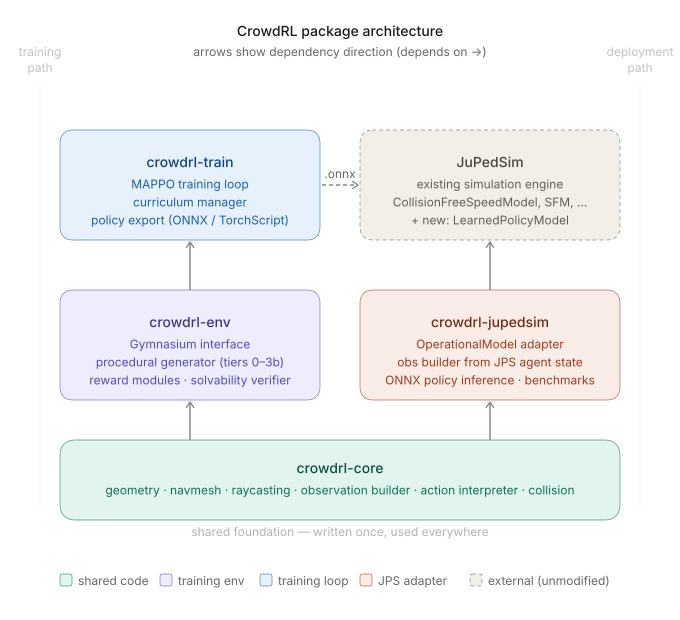
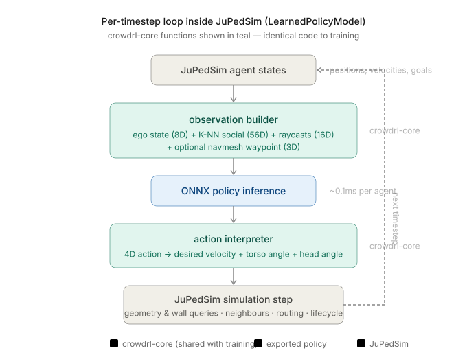

# CrowdRL

[](https://github.com/FabianPlum/CrowdRL/actions/workflows/ci.yml)
[](https://www.python.org/downloads/)
[](https://github.com/astral-sh/ruff)
[](LICENSE)

MARL-learned pedestrian navigation policies trained in procedural 2D environments,
validated against [IAS-7](https://www.fz-juelich.de/en/ias/ias-7) (Forschungszentrum Juelich)
controlled experiment data. Designed to replace or augment hand-crafted locomotion models
in [JuPedSim](https://www.jupedsim.org/).

## JuPedSim integration is available

A trained CrowdRL policy now runs inside JuPedSim as an operational model:

```python
from crowdrl_jupedsim import CrowdRLAgentState, LearnedPolicyModel, OnnxPolicy

model = LearnedPolicyModel(OnnxPolicy("example_model/policy_r0125.onnx"))
# no ObsConfig, no ActionConfig, no physics constants -- the artefact carries them
```

That is the whole deployment surface: hand it the shipped `.onnx` and use it
like any other JuPedSim model. The policy file is **self-describing** — its
resolved observation/action configuration, the dynamics it trained under, and
its provenance are embedded in the ONNX metadata, so deployment cannot silently
run a configuration the policy never saw (an explicit value that disagrees with
the record raises rather than being accepted).

How faithful is it? On the corner scenario, the deployed policy's trajectories
differ from the CrowdRL training engine's by **2.23 mm worst case** (1% of a
body radius over a ~10 s route), with per-agent exit times separated by exactly
the two iterations JuPedSim's exit stage lags by. That is not an accident of
tuning: the shipped policy was *fine-tuned under the deployment routing
contract*, so it was trained on the signal JuPedSim can actually supply. See
[`examples/10_jupedsim_learned_model.ipynb`](examples/10_jupedsim_learned_model.ipynb).

> [!IMPORTANT]
> **This requires JuPedSim 2.0 built from source — no released version works.**
> The integration targets `jupedsim.models.custom_model.CustomOperationalModel`,
> the pure-Python operational-model layer that exists only on upstream
> [`main`](https://github.com/PedestrianDynamics/jupedsim). The published PyPI
> line is still 1.x and does not have this API at all; JuPedSim 2.0 is a
> deliberate breaking change and is not yet tagged.
>
> Because of that, `crowdrl-jupedsim` deliberately declares **no** `jupedsim`
> dependency. Declaring one caused `uv sync` to install a 1.x wheel that then
> silently shadowed a local 2.0 source build. Supply 2.0 out-of-band instead:
> build it from source, then add a `.pth` file in your venv's `site-packages`
> containing the build's `lib/` (holding `py_jupedsim.*.pyd`/`.so`) and the
> repo's `python_modules/jupedsim`. Your `site-packages` must not contain a
> competing `jupedsim` install. Upstream is a moving branch, so expect to track
> it; the build recipe and the revision this was validated against are in
> [`plan/CrowdRL_Project_Plan_v9.md`](plan/CrowdRL_Project_Plan_v9.md).
>
> Everything else in this repo — training, the environment, the example
> notebooks 01-09 — works without JuPedSim. The JuPedSim-dependent tests skip
> themselves when no 2.0 build is importable, so the suite stays green.

## Architecture

The project is organised as a uv workspace with five packages that build in strict dependency order:

```
crowdrl-core  ->  crowdrl-env  ->  crowdrl-train  -.onnx->  crowdrl-jupedsim
                                \-> crowdrl-torch
```

<p align="center">
  
</p>

| Package | Purpose | Key dependencies |
|---------|---------|-----------------|
| **crowdrl-core** | Shared geometry, perception, and action library. No RL or JuPedSim dependencies. | NumPy, Shapely (+ Triangle via the `[geometry]` extra, needed only to build navmeshes) |
| **crowdrl-env** | Gymnasium training environment with procedural geometry generation (Tiers 0-3b) and multi-tier reward. | core + Gymnasium, Matplotlib |
| **crowdrl-train** | MAPPO training loop, curriculum manager, ONNX policy export. | env + PyTorch |
| **crowdrl-torch** | GPU-vectorised environments: batched PyTorch re-implementation of the env step for >100k steps/sec training. | core + env + PyTorch |
| **crowdrl-jupedsim** | `LearnedPolicyModel` adapter that plugs trained policies into JuPedSim's simulation loop, plus `LockstepPolicyModel`, a byte-exact validation instrument. | core + ONNX Runtime (JuPedSim 2.0 supplied out-of-band, see above) |

The only artefact crossing from training to deployment is an `.onnx` policy file.
One is shipped: [`example_model/`](example_model/) holds `policy_r0125.onnx`
together with the resolved config and scorecard of the run that produced it, so
the adapter, its tests and notebook 10 all work from a fresh clone.

### crowdrl-core

Pure geometry/perception/action library with no RL framework dependencies. Submodules:

- **geometry** -- Shapely polygon handling, constrained Delaunay triangulation, navmesh construction, wall-segment extraction, progressive polygon simplification for GPU segment budgets
- **navmesh** -- A\* on triangle adjacency graph + funnel algorithm (Simple Stupid Funnel) for shortest-path computation through portal edges
- **sensing** -- Raycast engine (N rays, configurable FOV, head-anchored) + K-nearest-neighbour social query
- **observation** -- Assembles the full observation vector from `WorldState`, identical in training and deployment
- **action** -- Maps 4D policy output to desired velocity + torso angle + head angle
- **collision** -- Elliptical agent collision detection + contact forces

**`WorldState`** is the critical interface: a flat dataclass consumed by all perception code.
Both `crowdrl-env` and `crowdrl-jupedsim` populate it. If population is correct, observations
are numerically identical between training and deployment -- this is the transfer guarantee.

### JuPedSim integration loop

At deployment time, the `LearnedPolicyModel` adapter runs each timestep:

<p align="center">
  
</p>

The teal blocks (`observation builder`, `action interpreter`) are **the same crowdrl-core code**
used during training -- no reimplementation, no drift.

### Observation space (80D base, 129D fully instrumented, 89D shipped)

| Component | Dims | Details |
|-----------|------|---------|
| Ego state | 8 | goal direction (2), velocity (2), speed (1), preferred speed (1, raw m/s), torso angle (1), head angle relative to torso (1) |
| Social | 56 | K=8 nearest neighbours: relative position (2), relative velocity (2), body orientation (1), body dims (2) |
| Raycasts | 16-32 | Head-anchored, 200 deg FOV, normalised distances. Optional 2-channel (distance + hit-type) |
| Navmesh | 3 | Next-waypoint direction (2) + path deviation (1) -- pre-computed via A\*+funnel at episode reset, pure GPU tensor lookup per step |
| Temporal memory | 6 | Own-trajectory history: displacement from spawn, cumulative path length, path efficiency, elapsed fraction, windowed displacement + goal progress |
| Neighbour velocity history | 16 | Per tracked neighbour (K=8), velocity change over the last W steps -- an acceleration proxy |
| Neighbour trajectory features | 24 | Per tracked neighbour, its own path efficiency + windowed displacement + goal progress |

All observations are in egocentric frame. Every block is independently
toggleable, so obs_dim is a config outcome, not a constant -- read
`ObsConfig.obs_dim` rather than adding these up by hand. Base is
`8 + 56 + 16 = 80`; fully instrumented with 1-channel rays is `129`.

The **shipped policy is 89D** (`8 + 56 + 16 + 3 + 6`) and, more interestingly,
is narrower than it could be *on purpose*. It runs with
`use_goal_direction=False`, navigating by the routed waypoint alone, and with
`use_jupedsim_style_routing=True`, which serves that waypoint the way
JuPedSim's router does (fixed 0.2 m portal inset) and pins the path-deviation
channel to 0.0. Both are the same principle: **do not train on a signal
deployment cannot supply.** A channel the deployed adapter has to fake is
better trained absent or degraded than trained rich and approximated later.

### Action space (4D continuous)

1. Desired speed (scalar, mapped from `[-1, +1]` to `[-max_backward_speed, +max_forward_speed]`; negative values mean motion opposite to heading)
2. Desired heading change (scalar)
3. Desired torso orientation change (scalar)
4. Desired head orientation change relative to torso (scalar, clamped +/-90 deg)

Defaults are asymmetric (`max_forward_speed = 2.0` m/s, `max_backward_speed = 0.5` m/s)
because humans walk forward much faster than backward. A hard
`max_velocity_magnitude = 3.0` m/s clamp on the actual velocity guards against
contact-force-induced blowup. All three numbers are experimental starting points
to be backed by literature.

## Getting started

### Prerequisites

- Python >= 3.12
- [uv](https://docs.astral.sh/uv/) package manager
- CUDA-capable GPU (recommended for training; CPU-only works but is much slower)

If you don't have uv installed ([full instructions](https://docs.astral.sh/uv/getting-started/installation/)):

```bash
# macOS / Linux
curl -LsSf https://astral.sh/uv/install.sh | sh

# Windows (PowerShell)
powershell -ExecutionPolicy ByPass -c "irm https://astral.sh/uv/install.ps1 | iex"
```

### Installation

```bash
# Clone the repository
git clone https://github.com/FabianPlum/CrowdRL.git
cd CrowdRL

# Install all workspace packages in development mode (includes Jupyter)
uv sync --all-packages --extra dev
```

### GPU training and Triton

The GPU-vectorised training pipeline (`crowdrl-torch`) uses `torch.compile` for
kernel fusion and CUDA graph capture, which requires [Triton](https://github.com/triton-lang/triton).

- **Linux**: Triton ships bundled with PyTorch -- no extra install needed.
- **Windows**: Supported via [triton-windows](https://github.com/triton-lang/triton-windows),
  included as a dev dependency. `torch.compile` works natively with CUDA GPUs.
  The package automatically sets a short `TORCHINDUCTOR_CACHE_DIR` (`C:\tmp\torchinductor`)
  to avoid Windows MAX_PATH (260 character) errors from Triton's generated filenames.
  For best results, also enable long path support system-wide (requires reboot):
  ```powershell
  # Run in an admin PowerShell
  reg add "HKLM\SYSTEM\CurrentControlSet\Control\FileSystem" /v LongPathsEnabled /t REG_DWORD /d 1 /f
  ```
- **macOS**: Triton is not supported. Use CPU training or a Linux remote.

### Single-node multi-GPU (DD-PPO) training

`crowdrl-torch` ships a DD-PPO-style single-node multi-GPU path
(`crowdrl_torch.distributed`): each rank runs its own `BatchedTorchEnv` and
`TorchRolloutCollector`, gradients are averaged via a flat `all_reduce`
after every `backward()`, and the obs / reward normalizers merge across
ranks via parallel Welford. `MAPPOUpdater` auto-detects the distributed
context and uses a globally-reduced KL for early stopping so all ranks
agree on the stop decision (preventing NCCL collective mismatches).

Launch with `torchrun`:

```bash
torchrun --standalone --nproc_per_node=N train_mappo.py
```

Design rationale and synchronisation details are in
[`plan/ddp_single_node.md`](plan/ddp_single_node.md).

### Running tests

Tests live alongside each package in `packages/*/tests/`, with a cross-package
integration suite in [`tests/`](tests/) at the repo root (e2e JuPedSim
scenarios, lockstep byte parity, dynamics provenance, config/metadata
round-trip). Both roots are picked up by default. The JuPedSim-dependent tests
skip themselves unless a 2.0 source build is importable, so a clone without one
still runs green.

```bash
# Run the full test suite
uv run pytest

# Run tests for a specific package
uv run pytest packages/crowdrl-core/tests/
uv run pytest packages/crowdrl-env/tests/

# Run with coverage
uv run pytest --cov=crowdrl_core --cov=crowdrl_env --cov-report=term-missing

# Run a single test file
uv run pytest packages/crowdrl-core/tests/test_navmesh.py -v
```

### Linting

```bash
uv run ruff check .
uv run ruff format --check .
```

### Example notebooks

The [examples/](examples/) directory contains Jupyter notebooks that walk through the core concepts:

| Notebook | Description |
|----------|-------------|
| `01_geometry_and_navmesh.ipynb` | Build walkable polygons, construct navmeshes, run A\* + funnel pathfinding |
| `02_sensing_and_observations.ipynb` | Raycasting, K-NN social queries, full observation assembly |
| `03_mini_simulation.ipynb` | End-to-end mini simulation with procedural geometry and agent stepping |
| `04_gymnasium_env.ipynb` | CrowdEnv Gymnasium environment: reset/step loop, reward tiers, visualisation |
| `05_mappo_training.ipynb` | MAPPO training loop with curriculum progression |
| `06_full_training.ipynb` | Full GPU-vectorised training with `crowdrl-torch`, async resets, ONNX export |
| `07_complex_geometry.ipynb` | Tier 3a/3b procedural geometry: rooms with obstacles, multi-room layouts, navmesh pathfinding |
| `08_lane_formation_test.ipynb` | Bidirectional-corridor lane-formation benchmark with order-parameter metric |
| `09_reward_landscape.ipynb` | Per-step reward decomposition across canonical scenarios (cruise, brake, wall approach, head-on, yield) |
| `10_jupedsim_learned_model.ipynb` | **The deployment story**: the shipped policy driving JuPedSim agents through the jupedsim#1625 corner and a 12-agent bottleneck, plus a trajectory-level fidelity comparison against the training engine. Needs a JuPedSim 2.0 source build (see above) |

```bash
uv run jupyter lab
```

## Current status

**Milestone progress** (see [project plan](plan/CrowdRL_Project_Plan_v9.md) for details):

| Milestone | Status |
|-----------|--------|
| M1: Environment prototype | **Complete** -- Tiers 0-3b geometry, solvability verification, navmesh router, GPU-vectorised env (>100k steps/sec) |
| M2: Baseline RL agent | **Complete** |
| M3: MARL training | **Substantially complete** -- MAPPO, GPU training, 6-phase curriculum (Tiers 0-3b), ONNX export. Goal-reaching is at 1.000 on 14 of 15 fixed eval scenarios; the exception is a 100-agent composed layout |
| M9: JuPedSim integration | **Substantially delivered** (ahead of schedule) -- `LearnedPolicyModel`, self-describing artefact, e2e scenarios, byte-exact validation instrument, example notebook. Outstanding: the cross-model benchmark runner and a public release |
| M4-M8 | Not started |

**All five packages are active**: `crowdrl-core`, `crowdrl-env`, `crowdrl-torch`, `crowdrl-train`, `crowdrl-jupedsim`

**Next up**: the high-density regime (at 60-100 agents the current policy trades
goal completion for collision avoidance -- it freezes rather than collides),
emergent behaviour documentation (M4), the cross-model benchmark against
JuPedSim's own models, and Tier 3 reward (distributional style matching from
PeTrack data)

**Not started**: Tier 4-5 geometry, IAS-7 geometry importer

## License

[MIT](LICENSE)
